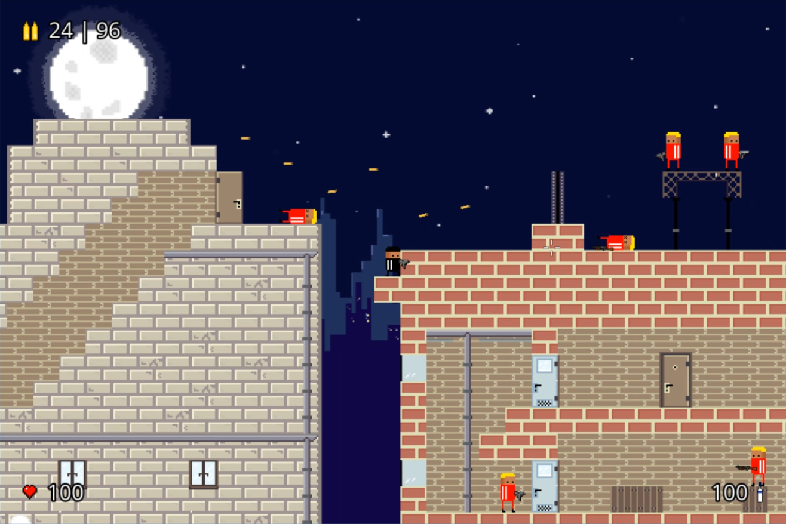
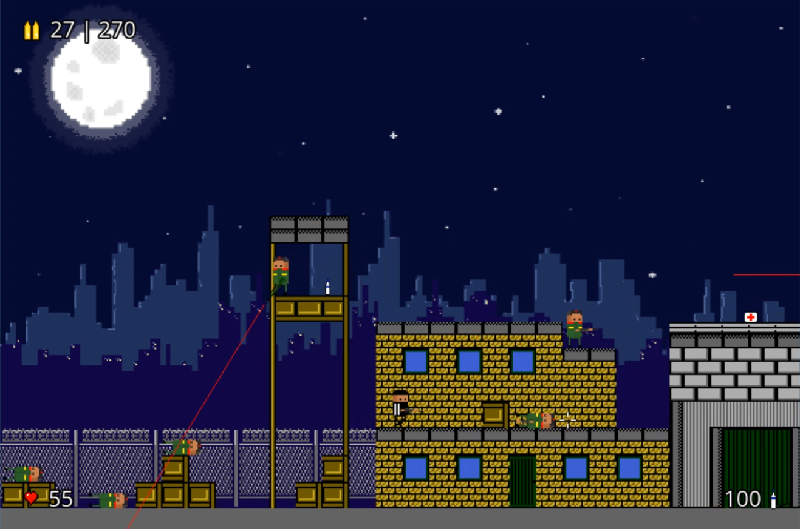
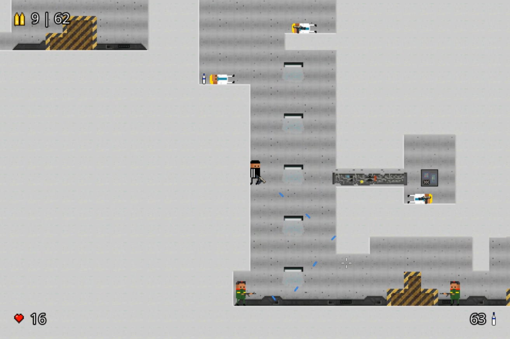

#  Meanwhile In Russia
Meanwhile In Russia is a 2D side-scroller shooter/platformer made using SDL only. This repo contains the source code for the game. You can play it on the browser (compiled to [WASM](https://webassembly.org) using [emscripten](https://emscripten.org)) at its [itch.io page](https://davidaf3.itch.io/meanwhileinrussia) or download the full game in the [Relesases](https://github.com/davidaf3/MeanwhileInRussia/releases) tab.

## Screenshots

## Credits
- [Side-scroller Character](https://opengameart.org/content/side-scroller-character) by myself.
- [Set of 2D characters](https://opengameart.org/content/set-of-2d-characters) by myself.
- [Brawler Asset Tile Set 'Military Base' NES](https://opengameart.org/content/brawler-asset-tile-set-military-base-nes) by Chasersgaming.
- [Sci-fi platform tiles (sectioned)](https://opengameart.org/content/sci-fi-platform-tiles-sectioned) by Eris and PancInteractive.
- [2D City tileset](https://opengameart.org/content/2d-city-tileset) by Gassasin.
- [pixel night city](https://opengameart.org/content/pixel-night-city) by fridaruiz.
- [Pixel Art 2D Weapons Pack](https://opengameart.org/content/pixel-art-2d-weapons-pack) by Cayden Franklin.
- [M249 SAW - Pixel Art](https://www.deviantart.com/animalistic-artworks/art/M249-SAW-Pixel-Art-586562401) by Animalistic-Artworks.
- [Tiny gun icons (16x16)](https://opengameart.org/content/tiny-gun-icons-16x16) by congusbongus.
- [vodka_wyborowa](http://pixelartmaker.com/art/21ae4da0250f895) by 9664c4.
- [Cloth swing sounds](https://opengameart.org/content/cloth-swing-sounds) by Vinrax.
- [Water sounds](https://opengameart.org/content/water-sounds) by Vinrax.
- [Shotgun Reload Sound effects](https://opengameart.org/content/shotgun-reload-sound-effects) by zer0_sol.
- [Handgun Reload Sound Effect](https://opengameart.org/content/handgun-reload-sound-effect) by zer0_sol.
- [The Free Firearm Sound Library](https://opengameart.org/content/the-free-firearm-sound-library) by Ben Jaszczak et al.
- [Headshot.wav](https://freesound.org/people/Pablobd/sounds/511194/) by Pablobd.
- [4 projectile launches](https://opengameart.org/content/4-projectile-launches) by Michel Baradari.
- [Ammo pickup #2](https://freesound.org/people/zivs/sounds/433771/) by zivs.
- [Chunky Explosion](https://opengameart.org/content/chunky-explosion) by Joth.
- [Gun reload sounds](https://opengameart.org/content/gun-reload-sounds) by SpringySpringo.
- [Light Machine Gun](https://opengameart.org/content/light-machine-gun) by KuraiWolf.
- [Chaingun, pistol, rifle, shotgun shots](https://opengameart.org/content/chaingun-pistol-rifle-shotgun-shots) by Michel Baradari.
- [Futuristic SMG](https://opengameart.org/content/futuristic-smg) by Michael Klier.
- [equipment clicks III](https://opengameart.org/content/equipment-clicks-iii) by LFA.
- [Action synth track](https://opengameart.org/content/action-synth-track) by PetterTheSturgeon.
- [Buran USSR](https://www.dafont.com/es/buran-ussr.font) by Denis Sherbak.
- [tinyxml2](https://github.com/leethomason/tinyxml2).